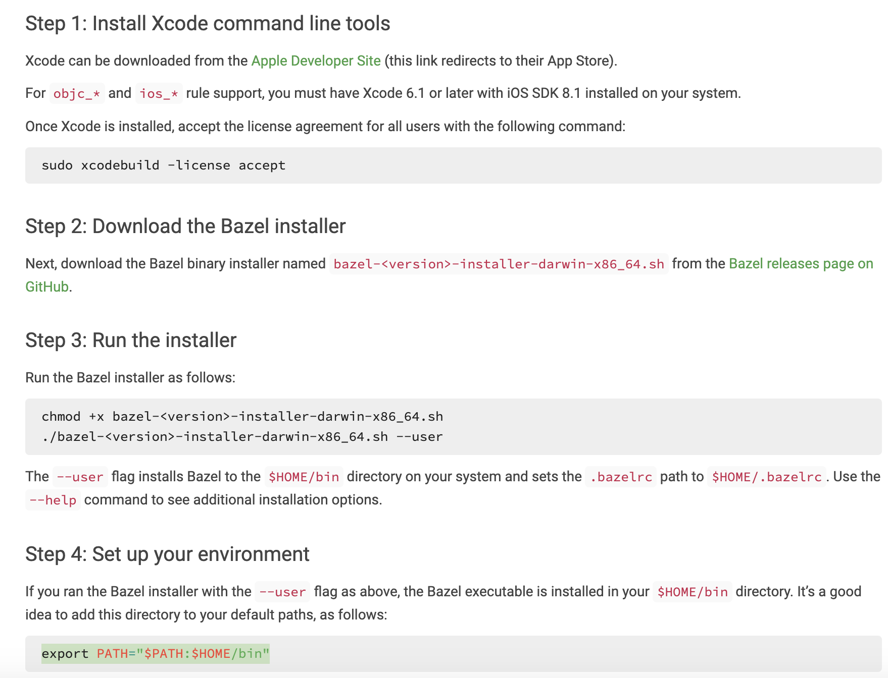
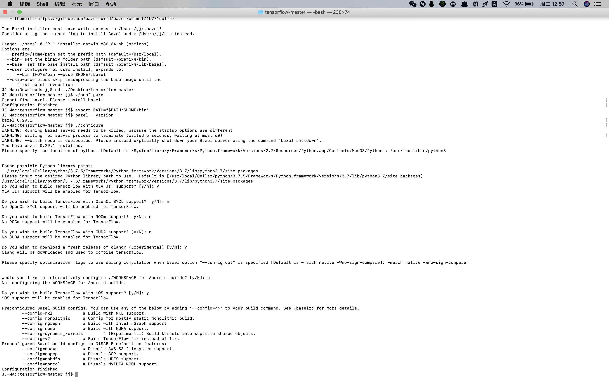
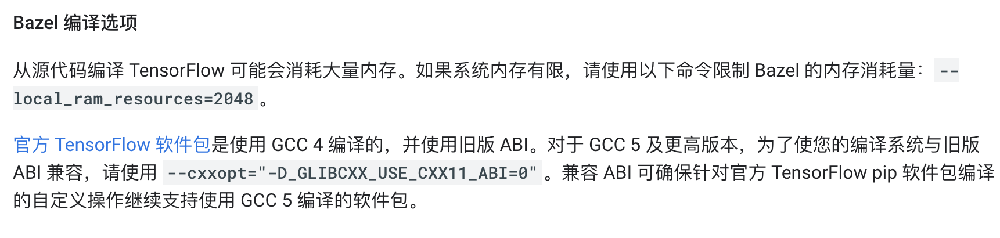

# mac or linux源代码编译安装tensorflow
## 为什么要从源代码编译？
如果直接“pip3 install tensorflow"的话，很可能出现如下警告：
``` bash
Your CPU supports instructions that this TensorFlow binary was not compiled to use: AVX2
```
此种警告的原因是pip安装的都是x86编译的，而大多系统都是64位，网上对于此种警告有两种解决方法，一种是在.py加上两行代码[屏蔽警告](https://blog.csdn.net/Fourierrr_/article/details/79749899)，一种就是找已经编译好的.whl文件然后pip3 install .whl文件就行，
编译好的文件[github链接](https://github.com/lakshayg/tensorflow-build)。  
但是这毕竟是别人编译的，更新速度不是很快，比如就没有支持最新catalina系统的(20191112)，
故笔者参考[官网教程](https://www.tensorflow.org/install/source)从源代码编译，由于一些细节问题官网教程没有详尽解释，故特此说明

## 安装过程
### 1 对于mac OS，需要安装homebrew(过程自查)
### 2 安装python3(apt(linux)或者brew(mac)安装)
### 3 安装 tensorflow pip依赖项
使用虚拟环境时，省略掉--user参数
```bash
pip3 install -U --user pip six numpy wheel setuptools mock future
```
```bash
pip3 install -U --user keras_applications
```
```bash
```
### 4 安装Bazel
这是[安装参考链接](https://docs.bazel.build/versions/master/install.html)，以下安装最新版的命令，但一般情况可能不需要安装最新版，具体后面会讲
```bash
brew tap bazelbuild/tap
brew install bazelbuild/tap/bazel
```
查看bazel版本，如果output版本说明安装成功
```bash
bazel --version
```
如果已经安装，可以升级
```bash
brew upgrade bazelbuild/tap/bazel
```
如果是安装以前的版本，可以参照上述参考链接安装，以下是针对mac的安装步骤 

<div align=center>

<center>Fig1:mac安装bazel</center>  
</div>

### 5 下载tensorflow源代码
使用git clone，如下  
```bash
git clone https://github.com/tensorflow/tensorflow.git
```
但是一般下载速度贼慢，网上针对git clone主要两种解决方法，一个是改host文件，一个是走代理外网。笔者只是看了看没试过，笔者是用了外网直接在[github](https://github.com/tensorflow)上下载的"tensorflow-master.zip"文件，然后解压成"tensorflow-master"文件夹。
如果需要以前的tensorflow版本，那还不如上这个[github链接](https://github.com/lakshayg/tensorflow-build)下载.whl直接install。
### 6 配置编译系统
首先cd到"tensorflow-master"文件夹，如果是git clone，那么直接按照官网上"cd tensorflow"就行。  
然后输入命令"./configure"回车，就会弹出结果。  
这个时候如果你安装的是bazel最新版，那么他会提示你版本太高去下一个低版本的，这时候回到步骤4中的参考链接下载以前的版本安装就行。  
bazel版本对了之后会出现一系列选择，如下图  

<div align=center>

<center>Fig1:配置编译系统/center>  
</div>

* 首先是选择python所在路径，一般是"/usr/local/bin/python3"，终端也会有提示
* 然后是选择python3路径，复制默认的提示路径就行
* 然后是选择g++和gcc路径
* 然后就是一堆支持选择，具体自查，不懂就全选N，不过最好一个个简单查一下，以下列出一些
[关于XLA JIT支持](https://blog.csdn.net/u011326478/article/details/102818518)
关于 OpenCL SYCL：选择y会让你选择路径，一般路径不存在说明你没安装，不如选N
关于ROCm：同上
关于CUDA支持：这是能够用GPU加速的关键
关于clang：笔者第六感选y
关于android：懂者自懂，不懂选N
关于IOS支持：笔者苹果笔记本选择了y，但没查这干啥的

### 7 编译pip软件包
对于CPU版
```bash
bazel build --config=opt //tensorflow/tools/pip_package:build_pip_package
```
对于GPU版
```bash
bazel build --config=opt --config=cuda //tensorflow/tools/pip_package:build_pip_package
```
编译时需要注意的问题(笔者是没注意(狗头)，哈哈)：  

<div align=center>

<center>Fig1:配置编译系统/center>  
</div>

这一步很久，估计两三个小时，耐心等待～～
### 8 编译软件包
对于从master编译，即最新版，输入以下命令  
```bash
./bazel-bin/tensorflow/tools/pip_package/build_pip_package --nightly_flag /tmp/tensorflow_pkg
```
就可以在/tmp/tensorflow_pkg文件夹下看到编译好的.whl文件啦，为了方便也可以更改路径比如在桌面
### 9 安装软件包
对于/tmp/tensorflow_pkg文件下的.whl，参考以下命令  
```bash
pip3 install /tmp/tensorflow_pkg/tensorflow+tab键补全.whl
```
此时就成功安装tensorflow了！
### 10 运行demo
新建.py脚本，复制以下代码：
```python
import tensorflow as tf
hello = tf.constant('hello world')  # 创建一个常量
print(hello)  # 输出
print(hello.numpy())  # 输出张量的值
print(hello.shape)   # 输出维度
print(hello.dtype)  # 输出张量类型
```
就可以开始tensorflow快乐之旅了！

    

    


