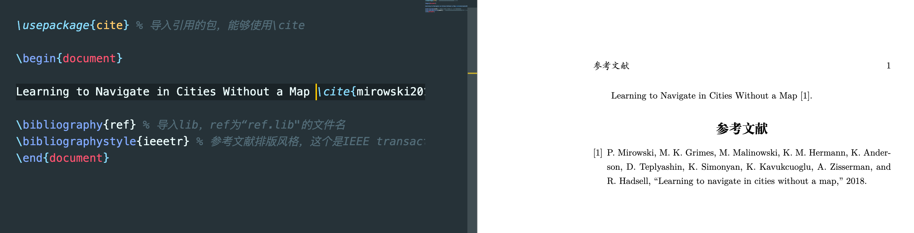

# VSCode+latex引用bibtex参考文献

## 0 写在前面

网上找了一些参考链接，如下

[参考链接1](https://blog.csdn.net/u011089523/article/details/82177218)、[参考链接2](https://blog.csdn.net/girl_kwy/article/details/79568442)、[参考链接3](http://www.bibtex.org/Using/)、[参考链接4](https://blog.csdn.net/qq_26972735/article/details/93319078)

但是他们说的还不够具体，并且针对VSCode也没有相关的更多描述(尽管类似)，另外特别是对于编译的具体过程没有比较详细的描述，因此有此一文。

本文是基于[VSCode配置latex环境](https://blog.csdn.net/JohnJim0/article/details/102934749)的一个补充。

## 1 操作步骤

### 1.1 新建lib

在.tex同一文件夹下，新建一个.lib文件，例如ref.lib，把要引用的文献的bibtex格式复制粘贴进去，这个各大搜索引擎如谷歌学术什么的应该都有，以下是一个例子，注意其中mirowski2018learning为引用文献的变量名

```bibtex
@misc{mirowski2018learning,
    title={Learning to Navigate in Cities Without a Map},
    author={Piotr Mirowski and Matthew Koichi Grimes and Mateusz Malinowski and Karl Moritz Hermann and Keith Anderson and Denis Teplyashin and Karen Simonyan and Koray Kavukcuoglu and Andrew Zisserman and Raia Hadsell},
    year={2018},
    eprint={1804.00168},
    archivePrefix={arXiv},
    primaryClass={cs.AI}
}
```

### 1.2 latex编写

编写如下

```;atex
\documentclass[UTF8]{ctexart} 

\usepackage{cite} % 导入引用的包，能够使用\cite

\begin{document}

% \cite括号内为引用文献的变量名，\cite前要有一个空格
% 在正文中引用，如果不引用则在参考文献部分中不显示该文献
Learning to Navigate in Cities Without a Map \cite{mirowski2018learning}. 

\bibliography{ref} % 导入lib，ref为“ref.lib"的文件名
\bibliographystyle{ieeetr} % 参考文献排版风格，这个是IEEE transaction的，其他可以自查
\end{document}
```

具体需要导入的包都已表明注释，如上

### 1.3 编译显示

标准编译命令如下，对于文件名"refrences.tex"的tex文件，在命令行需执行命令顺序如下

```bash
latex references.tex
bibtex reference
latex references.tex
latex references.tex
```

但是对于VSCode，由于latex workshop的插件，使得只需要保存就是自动执行latex编译"latex references.tex"，所以具体步骤可以稍作修改，如下

* 编辑好tex文件后，保存(快捷键cmd(ctrl)+s)

* 在VSCode终端内运行命令"bibtex reference"

* 回到tex在保存

此时就可以预览生成好的pdf文件了，效果如下，注意添加参考文献即更改lib文件之后需重新执行以上操作。

<div align=center>

<center>Fig1</center>  
</div>

