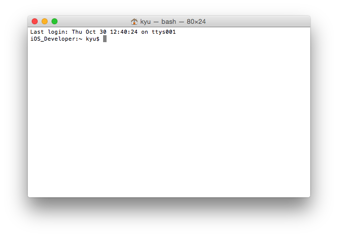
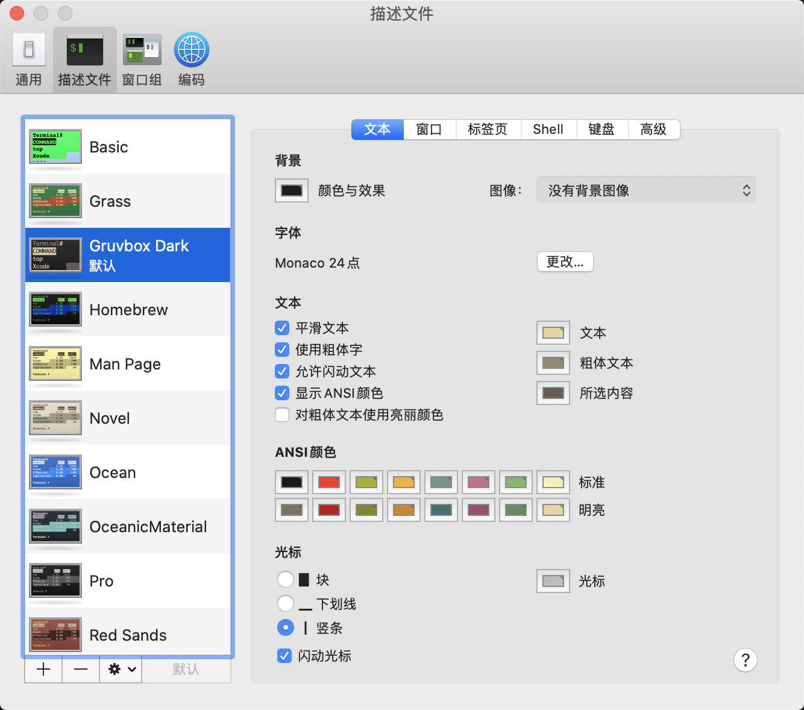

# 如何解锁终端界面的新姿势？
## 0 写在前面
先来一段RAP，在如今万物皆可编程的时代，终端自然也不会离开coder们的视野之外。而MAC系统终端的美观自然也成了原本的期待，但现实是如下的难看与苍白：
<div align=center>
 
</div>
实乃意料之外，就好像开着坦克，看着直播，点着外卖，无趣而又无奈！
不要悲伤，不要心急，一些trick可以让它变得生动可爱，敬请下文期待。


## 1 确定shell

首先需要确定终端运行的脚本环境，也就是shell，主要用的多是两种-bash和zsh，网上一些相关的终端自定义配置也是基于这两种。bash是比较老的版本，ubuntu和mac老系统默认的是bash，终端运行```echo $SHELL```可查看当前默认的shell，返回```/bin/bash``` 说明是bash环境，如果不是可以通过```chsh -s /bin/bash```更改，更改环境可以参考[简书](https://www.jianshu.com/p/3b0c3cfc4267)。而zsh是比较新的shell，在自动补全等方面有很多优点，推荐用这个。笔者两者都配过，所以就先讲bash的，关于zsh的可直接跳到第2节和第4节。

## 2 更改图式scheme

scheme不区分bash还是zsh，主要是更改了终端的背景以及字体等，而不能显示不同的颜色，推荐一个[github](https://github.com/mbadolato/iTerm2-Color-Schemes)上有丰富的主题，各终端主题可在主页预览，打开terminal文件夹选择中意的.terminal文件，怎么下载github的单独文件可以使用chrome浏览器的扩展程序**Octo Mate**。下载好之后之前双击就可以看见改变后的终端，此时在终端的偏好设置-描述文件将添加的terminal主题设置默认即可。此时根据个人爱好可以更改字体，比如Monaco，示例如下：
<div align=center>
 
</div>

## 3 主题与配色

本部分主要将bash终端的主题配色，并且同样适用于linux系统，不过需要将下文的```open .bash_profile```改为```sudo gedit .bash_profile```或者其他方式打开。这个很多博客上有详细的说明，笔者现在主用zsh环境，所以参考了一个[CSDN](https://blog.csdn.net/u011635492/article/details/84374325), 打开终端，然后```open .bash_profile```，将以下内容粘贴：

```bash
# Tell ls to be colourful
export CLICOLOR=1
export LSCOLORS=Exfxcxdxbxegedabagacad
 
# Tell grep to highlight matches
export GREP_OPTIONS='--color=auto'

export TERM="xterm-color"
# 这个比较普通
# PS1='\[\e[0;33m\]\u\[\e[0m\]@\[\e[0;32m\]\h\[\e[0m\]:\[\e[0;34m\]\w\[\e[0m\]\$ '
# 下面加了表情
# PS1='\[\033[01;36m\]\u😎 \[\033[01;33m\]\h \[\033[01;35m\]\t \[\033[01;31m\]\W\$ \[\033[00m\]😛 '
# 去掉时间
# PS1='\[\033[01;36m\]\u😎 \[\033[01;33m\]\h\[\033[01;31m\]\w\\$ \[\033[00m\]😛 '
# 去掉时间和电脑名字，本人采用
PS1='\[\033[01;36m\]\u😎 \[\033[01;31m\]\w\\$ \[\033[00m\]😛 '
```

然后```source .bash_profile```生效。贴上一张效果图XD:


## 4 关于zsh终端的配置
本部分同样适用于linux，另外注意mac catalina默认是zsh而不是bash，首先切换为zsh脚本环境，具体参考第1节，很多zsh终端配置说需要下载item2，item2是增强版的终端，但是实际上也不需要下载item2
### 4.1 安装oh-my-zsh
笔者直接用curl安装，注意安装curl之前可能需要安装brew和git等工具，按提示操作即可
```zsh
sh -c "$(curl -fsSL https://raw.githubusercontent.com/robbyrussell/oh-my-zsh/master/tools/install.sh)"
```
安装好之后会自动在根目录生成.zshrc文件。
### 4.2 主题与配色

终端```open .zshrc```打开，把默认的```ZSH_THEME="robbyrussell"```更换成别的theme，theme安装在```~/.oh-my-zsh/themes```路径下，笔者自己新建了一个my.zsh-theme文件，然后改成了```ZSH_THEME="my"```，具体配置如下：
```python
## based on murilasso
local return_code="%(?..%{$fg[red]%}%? ↵%{$reset_color%})"
local user_host='%{$terminfo[bold]$fg[green]%}%n@%m%{$reset_color%}'
local current_dir='%{$terminfo[bold]$fg[blue]%}%~%{$reset_color%}'
local rvm_ruby='%{$fg[red]%}$(rvm_prompt_info || rbenv_prompt_info)%{$reset_color%}'
local git_branch='%{$fg[blue]%}$(git_prompt_info)%{$reset_color%}'

# emoj can be found on https://emojipedia.org/grinning-face-with-one-large-and-one-small-eye/
# PROMPT="${user_host}😎 :${current_dir}${rvm_ruby}${git_branch}%b $%b 🤪 "
PROMPT="😎 :${current_dir}${rvm_ruby}${git_branch}%b $%b 🤪 "
RPS1="${return_code}"

ZSH_THEME_GIT_PROMPT_PREFIX=""
ZSH_THEME_GIT_PROMPT_SUFFIX=""
ZSH_THEME_GIT_PROMPT_DIRTY=" %{$fg[red]%}✗%{$reset_color%}"
ZSH_THEME_GIT_PROMPT_CLEAN=" %{$fg[green]%}✔%{$reset_color%}"
```
对了，这里的表情是在https://emojipedia.org/grinning-face-with-one-large-and-one-small-eye/这个网址上找到的，最后贴上最终的效果图，祝玩的愉快！
